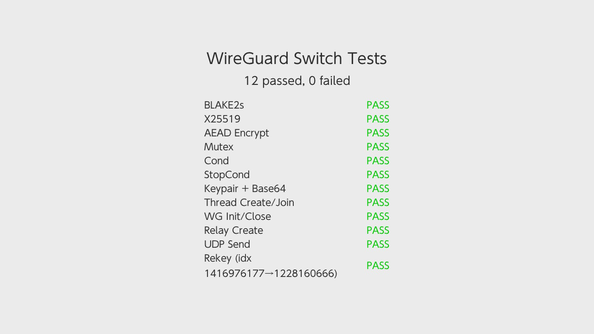

# wg-nx

Userland WireGuard library for Nintendo Switch. 



## Cryptography

| Algorithm | Implementation | Reference |
|-----------|---------------|-----------|
| ChaCha20 | ARM NEON (`src/wg_chacha20_neon.c`) | [RFC 8439](https://datatracker.ietf.org/doc/html/rfc8439) |
| Poly1305 | ARM NEON (`src/wg_poly1305_neon.c`) | [RFC 8439](https://datatracker.ietf.org/doc/html/rfc8439) |
| BLAKE2s | ARM NEON (`src/blake2s_neon.c`) | [RFC 7693](https://datatracker.ietf.org/doc/html/rfc7693) |
| X25519 ECDH | [Monocypher](https://monocypher.org/) | [RFC 7748](https://datatracker.ietf.org/doc/html/rfc7748) |

Monocypher provides X25519 and is used as a reference for verifying NEON correctness in tests.

### Protocol

| Component | Reference |
|-----------|-----------|
| WireGuard | [WireGuard Whitepaper](https://www.wireguard.com/papers/wireguard.pdf) |
| Noise IKpsk2 | [Noise Protocol Framework](http://www.noiseprotocol.org/noise.html) |


## API

```c
// Configuration
typedef struct {
    uint8_t private_key[32];
    struct in_addr tunnel_ip;
    uint8_t peer_public_key[32];
    char endpoint_host[256];
    uint16_t endpoint_port;
    uint16_t keepalive_interval;
    uint8_t preshared_key[32];
    int has_preshared_key;
} WgConfig;

// Lifecycle
WgTunnel* wg_init(const WgConfig* config);
int wg_connect(WgTunnel* tun);
int wg_start(WgTunnel* tun);
void wg_stop(WgTunnel* tun);
void wg_close(WgTunnel* tun);

// Send/receive
int wg_send(WgTunnel* tun, const void* data, size_t len);
int wg_recv(WgTunnel* tun, void* buf, size_t len, int timeout_ms);
void wg_set_recv_callback(WgTunnel* tun, WgRecvCallback cb, void* user);

// Session
int wg_rekey(WgTunnel* tun);
uint32_t wg_get_session_index(WgTunnel* tun);
int wg_get_ip(WgTunnel* tun, struct in_addr* addr);

// Key utilities
void wg_generate_keypair(uint8_t priv[32], uint8_t pub[32]);
int wg_key_from_base64(uint8_t key[32], const char* b64);
int wg_key_to_base64(char* b64, size_t len, const uint8_t key[32]);

// Logging
void wg_set_log_callback(void (*func)(const char* msg));
```

### UDP Relay

For apps that expect a normal UDP socket:

```c
WgRelay* wg_relay_create(WgTunnel* tun, uint16_t local_port);
int wg_relay_start(WgRelay* relay);
void wg_relay_stop(WgRelay* relay);
void wg_relay_destroy(WgRelay* relay);
uint16_t wg_relay_get_port(WgRelay* relay);
```


## Testing

`wg-tester/` provides a borealis app that tests several basic tests + a small integration rekey test against the publicly avaliable wireguard demo server.
